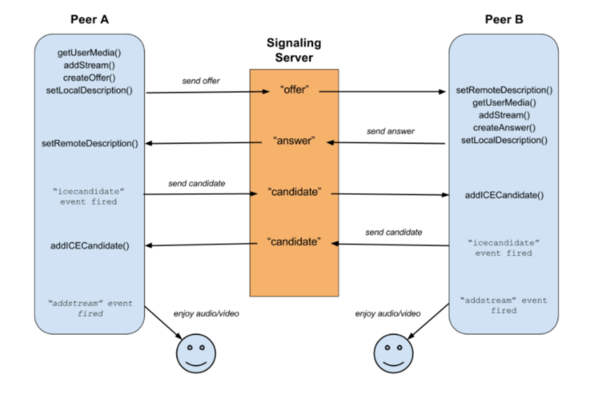

# Zoom Clone Coding
참고 사이트: https://nomadcoders.co/noom/lobby
  
Zoom Clone using NodeJS, WebRTC and Websockets.

----
### 2024-01-12
* 개발 환경 구축
    * Nodemon
        * 노드 서버를 키고 코드를 수정하거나 업데이트 시, 서버를 내리고 다시 반영시키는 데 도움을 주는 기능
        * nodemon.json을 설정하여 재실행시 수행해야 하는 것들을 정리함.
        * 해당 프로젝트에서는 exec를 추가하여 다음과 같은 명령어를 수행함. 
          > babel-node src/server.js 
    * Babel
        * 자바스크립트 컴파일러. javascript로 결과물을 만들어준다고 생각하면 좋다.
        * babel-node를 실행시키면 babel-node는 바로 babel.config.json을 찾는다. 거기서 코드에 적용해야 하는 preset을 실행한다.
    * Express.js
    * 기타
        * public에 존재하는 js는 Frontend에서, 
        그 밖에 있는 server.js는 Backend에서 구동될 것이다.

### 2024-01-13

#### (이론) HTTP vs WebSocket(어제 푸쉬 안해서 복습 겸 다시 정리..)

* HTTP 

클라이언트 (request) ↔ 서버 (response) 가 번갈아서 발생. 

Stateless하다는 특징을 갖고 있어, 서버는 클라이언트를 기억하지 못하므로 로그인 유지와 같은 기능이 필요할 시, cookie를 서버에게 보내는 방식으로 유지하여야 한다.

* WebSocket

클라이언트가 서버에게 요청하면 서버는 수락 혹은 거부를 한다. 
서버가 수락한다면 클라이언트와 서버는 연결(connection)되어 연결을 끊기 전까지 원하는대로 request와 response를 주고받을 수 있다. 

참고) 
일부 framework에서는 이미 채팅방 기능이 있다. 
npmjs에 있는 ws 라이브러리의 경우, webSocket의 기초적인 기능만 있다. 이를 이용하여 채팅방과 같은 기능을 구현하려면 개발자가 logic을 구현해야 한다.

---
* 개발 관련
    * express 변경
        * ws서버를 만드는 대신 express서버와 합침.(합치기 전의 express 서버는 http를 다룸.)

### 2024-01-18

#### SocketIO vs Websocket
SocketIO는 실시간 웹 애플리케이션을 위한 이벤트 기반 라이브러리이며, websocket의 부가기능이 아니다.
websocket은 SocketIO가 실시간, 양방향, event 기반 통신을 제공하는 방법 중 하나다.

A 라는 브라우저가 websocket을 지원하지 않는다고 하여도 socketIO는 작동한다.

#### socketIO의 adapter
어플리케이션의 규모가 커지면서 여러 서버가 생기게 된다면,
여러 서버가 하나의 DB를 보게 만들고 결국 adapter를 통해 일관성을 유지해야 한다.

### 2024-01-21

#### webRTC
실시간 커뮤니케이션을 가능하게 해주는 기술. P2P 방식. 
이전에 webSocket으로 채팅을 구현했을 때 이는 P2P 방식이 아니었다. 
유저A가 메시지를 보내면 유저B에게 가는 것이 아닌,
서버로 메시지를 보내게 되고, 서버가 유저B에게 전달하는 방식이었다. 
이는 P2P가 아닌 그냥 유저끼리 서버에 연결되어 있는 것이다.
  
webRTC는 P2P 방식으로, 유저의 영상, 오디오, 텍스트가 서버를 거치지 않고 바로 다른 유저에게 전달된다. 

signaling이 끝나면 P2P 연결이 된다. 
브라우저는 서버한테 setting이나 configuration, 위치를 알려준다. 
그럼 서버는 상대방의 위치나 정보를 알려준다. 
이후, 서버에게 받은 정보와 위치를 이용하여 P2P 연결을 할 수 있다.
  

참고 사이트: 
[[webRTC] 5. 라이브 스트리밍 구현 (1) offer & answer](https://oneroomtable.com/entry/WebRTC-5-%EB%9D%BC%EC%9D%B4%EB%B8%8C-%EC%8A%A4%ED%8A%B8%EB%A6%AC%EB%B0%8D-%EA%B5%AC%ED%98%84-1-offer-answer)

#### IceCandidate?
Internet Connectivity Establishment(인터넷 연결 생성) 
webRTC에 필요한 프로토콜을 의미함. 멀리 떨어진 장치와 소통할 수 있게 하기 위함. 
Ice Candidate는 브라우저가 서로 소통할 수 있게 해주는 방법이다. 
어떤 소통 방법이 가장 좋을 것인지를 제안할 때 씀. 
다수의 candidate(후보)들이 각각의 연결에서 제안되고 그리고 그들은 서로의 동의 하에 하나를 선택한다. 그리고 그것을 소통 방식에 사용한다. 

참고)
[RTCIceCandidate](https://developer.mozilla.org/ko/docs/Web/API/RTCIceCandidate)

#### Sender?
myPeerConnection을 살펴보면 Sender라는 것이 있다. (RTCRtpSender)
Sender는 무엇일까? 
 
Sender는 우리의 peer로 보내진 media stream track을 컨트롤하게 해준다. 
ex) replaceTrack
 

참고)
[RTCRtpSender](https://developer.mozilla.org/en-US/docs/Web/API/RTCRtpSender)

#### STUN 서버?
STUN 서버는 컴퓨터가 공용 IP주소를 찾게 해준다. 
어떤 것을 request하면 인터넷에서 브라우저가 누군지를 알려주는 서버이다. 서버는 공용 IP를 알려줄 것이다.
  
구글에서 무료로 제공하는 서버가 있다. 이를 이용하여 STUN 서버를 만들 수 있다.

#### Data Channel...
P2P 유저가 언제든지 모든 종류의 데이터를 주고 받을 수 있는 채널. 
이미지, 파일, 텍스트 같은 것들도 서로 주고받을 수 있게 된다. 
Data Channel을 만든다면 Socket.io도 필요 없을 것이다. 

 
먼저, 무언가를 offer하는 socket이 Data Channel을 생성하는 주체가 되어야 한다. 
그리고 offer를 만들기 전에 Data Channel을 만드는 것이다. 
다른 peer는 Data Channel이 있을 때 EventListener를 만들면 된다.

[RTCDataChannel](https://developer.mozilla.org/en-US/docs/Web/API/RTCDataChannel)

#### webRTC를 쓰면 안되는 곳?
너무 많은 peer를 가진다면 webRTC가 좋지 않을 수 있다. 
peer 수가 늘어나면 느려지기 시작할 것이다. (peer-to-peer로 서로 연결되어 있기 때문) 

대신 몇몇 회사는 Mesh가 아닌 SFU 라는 것을 사용한다. 
SFU(Selective Forwarding Unit). 이는 서버에 의존한다. 
서버는 유저들 모두로부터 스트림을 받는데, 서버는 그 스트림들을 압축하고 있다. 
그리고 서버는 누가 방의 호스트인지, 누가 말하고 있는지 등을 알고 있다. 
만약 한 유저가 발표를 하고 있지 않다면, 카메라 화면이 있지만 작을 것이고, 그 때 서버는 해당 스트림을 압축한다. 
그래서 사람들이 스트림을 다운로드할 때 질이 좋지 않은 스트림을 다운로드한다. 

